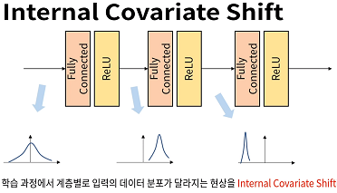
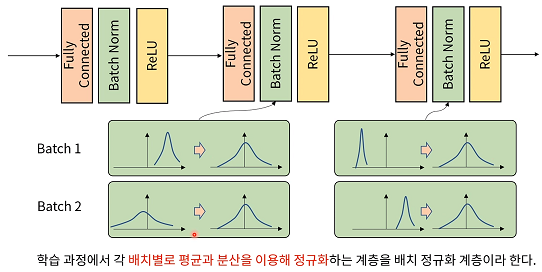
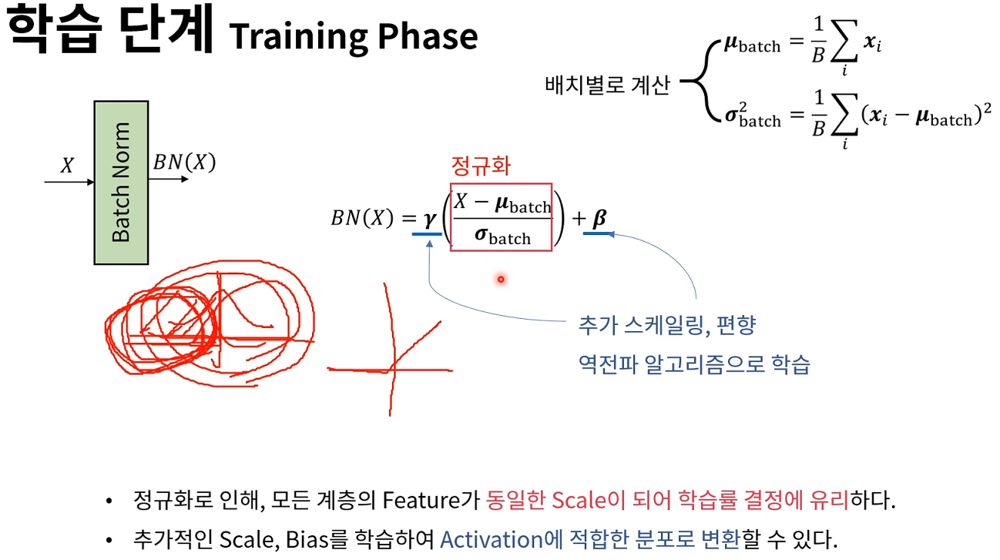
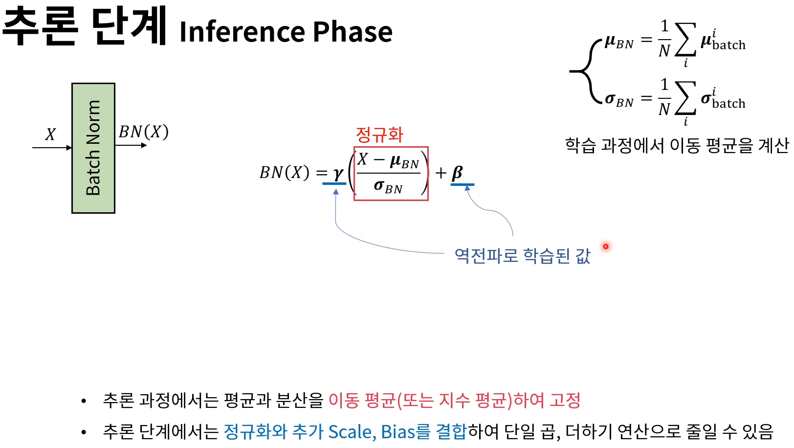
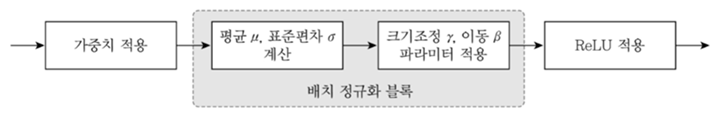
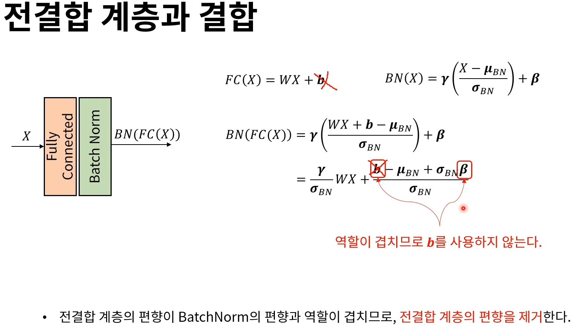
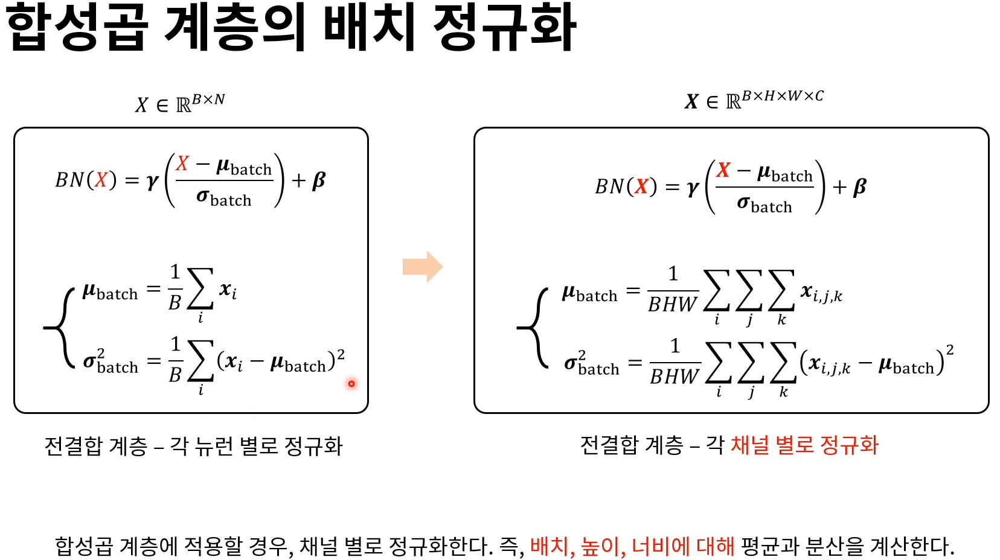
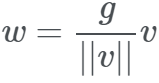
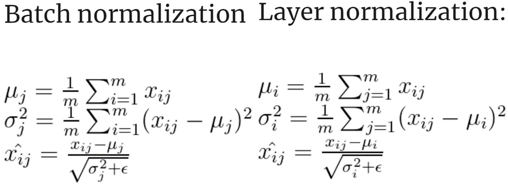
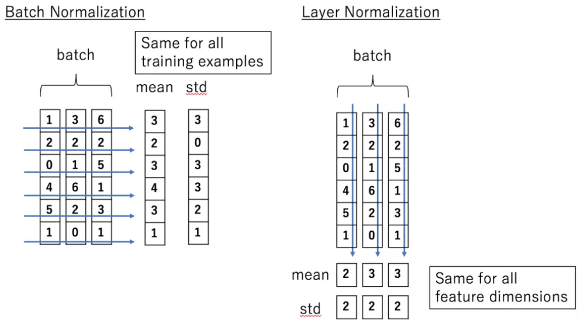

## Batch 학습

- 데이터가 많게 되면 당연히 모든 데이터를 학습 할 수는 없으므로 배치 학습을 진행해야 함.
- 미니 배치를 사용하여 데이터에 포함된 오류에 대해 둔감한 학습 가능  -> 과적합 문제 완화에 도움 
- **근데 배치 학습을 하게되면 배치마다 서로 Output 분포가 다른현상이 발생**
- internal corvariate shift(내부 공변량 이동문제) 현상 발생함 -> 따라서 Batch Nomralization이 필요
- 공변량 = 여러 변수들이 공통적으로 함께 공유하고 있는 변량
    - ex) 뉴럴 네트워크에 평균 0 분산 1로 규격화 된 분산을 넣어주는 것은 연구자가 통제하고자 하는 변수로써 이를 공변량이라 한다. 

- **공변량 변화 - 입출력 규칙(입출력 넣어주는 방식)은 훈련시와 테스트에 같음. 반면 입력(공변량)의 분포가 훈련과 테스트가 다른 상황**

- 이전 층들의 학습에 의해 이들 층의 가중치가 바뀌게 되면, 현재 층에 전달되는 데이터의 분포가 현재 층이 학습했던 시점의 분포와 차이가 발생(이전층 현재층 둘다 100단위였는데 갑자기 이전층이 바뀌면서 10단위가 되어버려서 그러면 차이가 발생하니까 애초에 둘다 정규화하여 낮춰놓는 것)

- 모든 Batch 간에 정규화를 진행함
- Standardization은 표준화라고 하며, Standard Scaler 또는 z-score normalization을 의미함. 기존 데이터를 평균 0 표준편차 1인 표준분포의 꼴 데이터로 만드는 것을 의미

## Batch Normalization
- 모든 Batch 간에 Normalization을 적용함 (각 배치간에 연산한다는 점이 중요!!)
- 평균과 분산을 동일하게 함

## Batch Normalization의 학습
- 정규화
    - 정규화는 데이터의 범위를 0과 1로 변환하여 데이터 분포를 조정하는 방법이다. 
    - (값 - 평균) / 표준편차 작업을 하게 되면 전체가 동일한 스케일이 됨
- 만약 Relu 후에 Batch Normalization을 쓰면 가중치에 대해 Relu는 음수면 없애는 거니까 구한 가중치의 음수 즉 절반이 날라감 -> 추가적인 Scale과 Bias를 학습하여 Activation에 적합한 분포로 변환함 (역전파 알고리즘시 반영됨)
- 정규화를 하게 되면 모두가 동일한 Scaling 으로 학습되기 때문에
    - 학습률이 클시 발산되는 경우나
    - 학습률이 작을때 학습이 안되는 경우등 방지 가능
    

- 입력을 평균으로 빼주고 표준편차로 빼주는 Standarization 과정을 거치는 것이고, 
- 감마와 베타는 역전파로 학습된 값으로 사용하고
- 배치노멀라이제이션(BN)평균과 표준편차 값들은 이동평균 또는 지수평균을 이용하여 구함
- 최종적으로 단일곱 단일 더하기 연산으로 줄여주기 가능

## 추론단계
- 추론과정시에는 평균과 분산을 이동 평균하여 고정 ( 아마 Batch 전체 에 대한 평균과 분산) -> 추론시에는 1장씩 할 수 도 있으니까
- 추론단계에서는 정규화와 추가 Scale, Bias를 결합하여 단일 곱, 더하기 연산으로 줄일 수 있음

## Batch Normalization 순서
- 배치 정규화 사용시 가중치 초기값에 크게 영향을 받지 않아서, 초깃값 설정에 크게 신경쓸 필요가 없어지고, 학습률을 아주 작게 설정할 필요도 없어, 학습이 빨리 진행되는 경향을 보인다. 또한 과적합을 억제하는 특성이 있어서, 드롭아웃을 사용하지 않아도 성능이 좋은 신경망 모델이 학습될 수도 있음.

## Fully Connected Layer 와의 BatchNormalization
- x부분에 BN(X) 가 들어옴
- 학습을 할때는 Bias를 쓰지 않음. 

## 합성곱 계층의 배치정규화
- 배치, 높이, 너비에 대해서 적용이 다름

## 배치정규화 문제점
- Mini-batch에 의해 크게 영향을 받는다
    - 배치의 크기가 너무 작으면 잘 작동하지 않음 (대표성을 띄기가 어려움)
    - 메모리의 한계로 RNN이나 크기가 큰 CNN에 적용하기 어렵다
- 배치의 크기가 너무 커도 잘 동작하지 않는다
    - 병렬화 연산 효율이 떨어진다
    
## 가중치 정규화 (Weight Normalization)
- Weight Normalization은 mini-batch를 정규화하는 것이 아니라 layer의 가중치를 정규화함
- Weight Normalization은 레이어의 가중치 w를 다음과 같이 re parameterize 시켜 g와 v로 분리 (g-크기, v-방향)
- w 벡터의 방향으로부터 norm을 분리시킨 후 g와 v를 gradient descent하여 optimize 한다. 이것을 통해 dynamics를 배우고 최적화를 쉽게 만든다.
- 다만 이 방법은 평균을 0으로 보장해주지 못하기 떄문에 mean-only batch normalization과 함께 사용할 것이 권장된다.

## 계층 정규화 (Layer Normalizaion)
- 기존 배치에 정규화를 적용하지 않고 Feature에 대해 한다는 것이 다름
- 배치의 크기에 영향을 받지 않고 RNN 에서 잘 동작함

## 기타
- 자기 정규화 신경망(Self-Normalizating Neural Network)
    - BatchNormalization 이 안될 때 ? Self-Normalizing Neural Networks 도 하나의 방법인듯

## 참고논문
- https://wingnim.tistory.com/92
