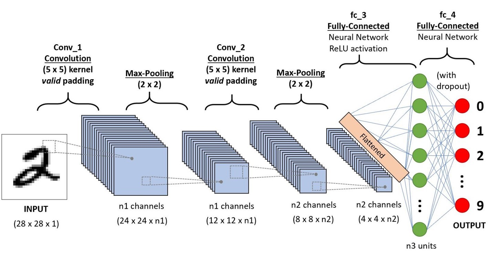
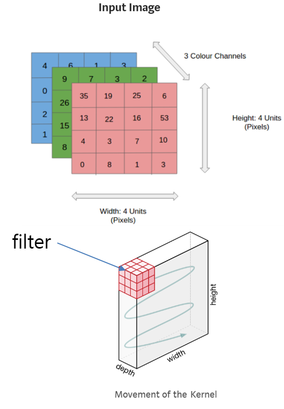
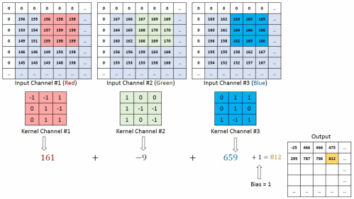
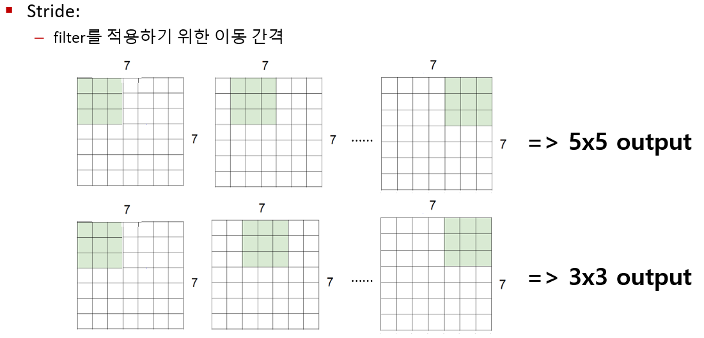
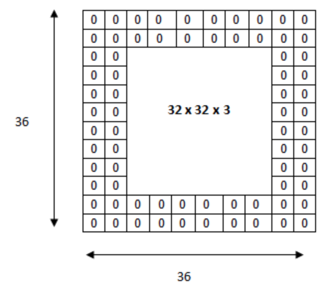
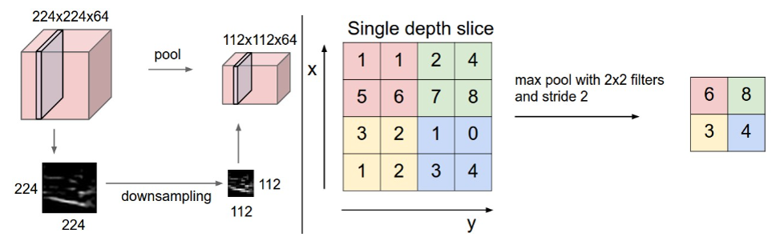
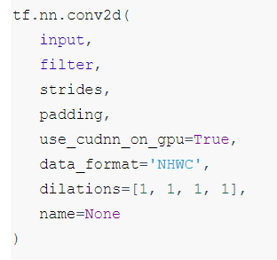
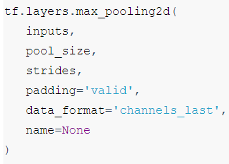

## CNN 

### ■ Convolution 연산

- 입력계층 -> 합성곱 은닉 계층 -> 완전 연결 은닉 계층 -> 출력 계층
-  **합성곱 계층은 특징점을 효과적으로 찾는데 활용**되고, **완전 연결 계층은 찾은 특징점들을 기반으로 이미지를 분류하는데 주로 활용**.
- 각각의 주목적이 ‘특징점 찾기’와 ‘실질 분류하기’ 라고 하더라도 스스로 학습해 신경망이 최적화 되기 때문에 그 역할이 적정하게 둘에 분배되는 것. 즉 CNN이 어느 한쪽이 절대로 특정 역할을 한다고 말하기 어렵다.
- 이미지는 높이, 너비, 깊이로 구성된 3차원 형상, 깊이는 이미지의 채널로 빨,파,녹색이다.
- CNN의 뉴런은 3차원 형상을 이용하기 위해 3차원 데이터 형식으로 저장된다.
- 학습된 필터는 이미지의 특징 또는 패턴을 검출하며, 레이어가 깊어질수록 패턴은 더 추상적이다. (이러한 레이어들은 에지, 모서리, 패턴을 검출한다)
- 이미지 채널은 이미지 배열 맨 앞단 or 맨 끝단에 존재한다
- CNN은 합성곱 계층을 이용하여 적은 가중치 수로도 이미지 분류에서 높은 성능을 내며 가중치 수가 적기 때문에 과적합의 가능성도 낮다. 
- 이미지의 특성에 맞게 합성곱 필터링이 이루어지기 때문에 이미지 내에 있는 특징점 또한 잘 찾아낸다.
- 장점
    - 장점 1. 연산량 : 모든 픽셀에 대해 연산 진행하는 dnn과 다르게 convolution 크기 * feature map 개수 만큼만 연산을 하기 때문에 연산량이 줄어듬
    - dnn과 다르게 input 정보들을 flatten하지 않기 때문에 공간정보를 담을 수 있음

    - 장점 2. overfitting 방지 : 다양한 관점에서 이미지를 인식하는 feature map이라는 개념을 사용해 overfitting을 방지함
    - dnn은 픽셀 정보 하나하나에 대해 가중치를 갱신하지만 cnn은 convolution 크기만큼만 가중치를 갱신하기 때문에 overfitting이 날 확률이 줄어듬

- 차이점 (vs DNN)
    - 각 레이어의 입출력 데이터의 형상 유지
    - 이미지의 공간 정보를 유지하면서 인접 이미지와의 특징을 효과적으로 인식
    - 복수의 필터로 이미지의 특징 추출 및 학습
    - 추출한 이미지의 특징을 모으고 강화하는 Pooling 레이어
    - 필터를 공유 파라미터로 사용하기 때문에, 일반 인공 신경망과 비교하여 학습 파라미터가 매우 적음
    

### ■ 합성곱 계산 순서 
- input -> channel별 convolution 연산 -> 결과 합친 최종 Feature Map 생성

- convolution 연산 후 bias를 추가로 더함. 
- **bias란 해당 뉴런이 본질적으로 가지고 있는 값**

### ■ 커널 (kernel) - Filter 통과
- **입력 데이터의 채널 수 (컬러면 -3 ) 일 경우 필터의 채널수와 같아야 한다.**
- CNN에서 Filter와 Kernel은 같은 의미이며, 일반적으로 (4, 4)이나 (3, 3)과 같은 정사각 행렬로 정의됨
- CNN에서 학습의 대상은 필터 파라미터임
- kernel은 이미지와 컨볼루션연산을 할 매개변수이다. 커널에는 stride와 크기(size)라는 두개의 매개변수가 있다.

### 특징 맵(Feature Map)
- **컨볼루션 연산은 필터로 표현되는 특징이 데이터 영역에 얼마나 강하게 존재하는지 평가하는 역할 수행**
- 입력된이미지에 대해서 filter를 적용하여 새로운 이미지인 feature map을 생성
- 컨볼루션 필터의 적용 결과로 만들어지는 2차원 행렬 , 특징지도의 원소값
- 컨볼루션 필터에 표현된 특징을 대응되는 위치에 포함하고 있는 정도
- k개의 컨볼루션 필터를 적용하면 k개의 2차원 특징지도 생성 (2차원 피쳐맵이란건 물론 컬러는 3차원이지만, 좀더 큰 개념으로 봤을 때 가로세로 있는 이미지니까 2차원이란 것-컬러값들은 그냥 다 한가지 점으로 표현되고 ㅇㅇ)

### ■ Stride
- stride는 매번 이동하게 되는 픽셀수이고, 스트라이드가 1인 경우 거의 동일한 크기의 이미지를 생성하며, 2인 경우 절반 크기의 이미지를 생성한다.

### ■ 패딩 (padding)
- Convolution 레이어에서 Filter와 Stride에 작용으로 Feature Map 크기는 입력데이터 보다 작다.
- **Convolution 레이어의 출력 데이터가 줄어드는 것을 방지하는 방법으로 입력 데이터의 외각에 지정된 픽셀만큼 특정 값으로 채워 넣는 것을 의미**
- 보통 패딩 값으로 0으로 채워 넣습니다.
- 레이어 외부에 일정한 값의 레이어를 덧대는 것을 의미, 일반적으로 0많이 사용. padding이 1이면 1칸씩, padding이 2이면 2칸씩 둘러쌈
- 함수인자
    - ‘valid’ : 유효한 영역만 출력이 됩니다. 따라서 출력 이미지 사이즈는 입력 사이즈보다 작습니다.
    - ‘same’ : 출력 이미지 사이즈가 입력 이미지 사이즈와 동일합니다.
    - 'VALID': 합성곱층에 zero-padding을 사용하지 않는다. 그렇기 때문에 합성곱 연산을 통해 이미지의 데이터 손실이 일어난다.

    - 'SAME' : 합성곱층에 zero-padding을 사용하며, 이 경우에는 출력 특성맵의 크기는 입력을 스트라이드로 나눈 다음 올림 한 것과 같다(ceil(13/5)=3).

### ■ 풀링 (Pooling)
- Convolution 레이어와 비교한 특징
    - 학습대상 파라미터가 없음
    - Pooling 레이어를 통과하면 행렬의 크기 감소
    - Pooling 레이어를 통해서 채널 수 변경 없음
- 일반적으로 MaxPooling 사용 
- **이 레이어는 영상의 작은 변화라던지 사소한 움직임이 특징을 추출할 때 크게 영향을 미치지 않도록 함**
- 얼굴 인식 문제를 예를 들면, 맥스풀링의 역할은 사람마다 눈, 코, 입 위치가 조금씩 다른데 이러한 차이가 사람이라고 인식하는 데 있어서는 큰 영향을 미치지 않게 한다.

- 풀링은 오버피팅이 발생하는 것을 막기 위해 정규화 역할을 한다. 풀링은 모든 채널에서 수행되고 다양한 크기의 스트라이드로 수행될 수 있다.
- 평균값 풀링은 강한 특징의 영향이 상대적으로 약화 가능성이 있음.
- 확률적 풀링(stochastic pooling) : 블록 내의 각 원소가 원소값의 크기에 비례하는 선택 확률을 갖도록 하고, 이 확률에 따라 원소 하나를 선택(랜덤으로 선택하는 것) 
- 동일한 입력이여도 적용 결과가 매번 다를 수 있어 , 학습시에만 확률적 풀링을 사용하면 좋음. 추론시에는 확률적 가중합을 사용. (그냥 각각확률 * 각각의값)
 

### ■ 함수 예제 인자 설명

- Convolution 함수

    - filter 는 [ FH, FW, IN_CH, OUT_CH] 형태의 4D Tensor (Filter 높이, 너비, 이전층 특성맵수, 현재층 특성맵수) 로 만들어 줘야 한다. ->[3,3,1,32]

    - data_format 인자는 채널(c)의 위치를 앞에다 할것인지, 뒤에다 할것인지 설정 (디폴트는 NHWC 채널을 앞으로 하고 싶은 경우 - NCHW (Batch, channel, height, width)
    - padding은 same, valid 

- Pooling 함수

### ■ 기법 종류에 따른 모델
<table>
    <tr><td>Classification</td><td>LeNet / AlexNet / VGG Nets / GoogleNet / ResNet</td></tr>
    <tr><td>Image Detection</td><td>RCNN / Fast RCNN / Faster RCNN / SPP Net / Yolo / SDD / Attention Net</td></tr>
    <tr><td>Semantic Segmentation</td><td>FCN / DeepLab v1, v2 / U-Net / ReSeg </td></tr>
</table>

### ■ 참고 문헌
- http://taewan.kim/post/cnn/
- https://excelsior-cjh.tistory.com/180