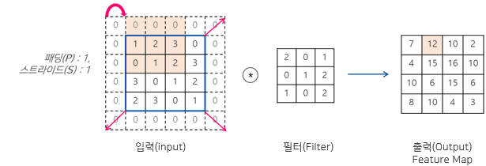
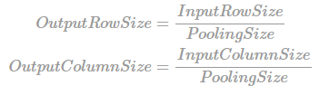
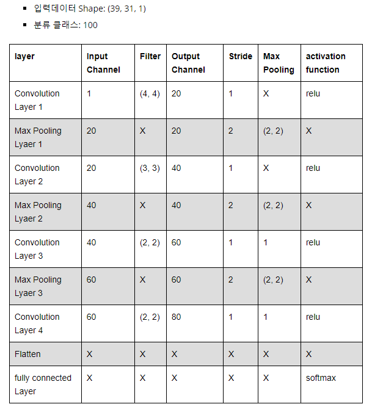
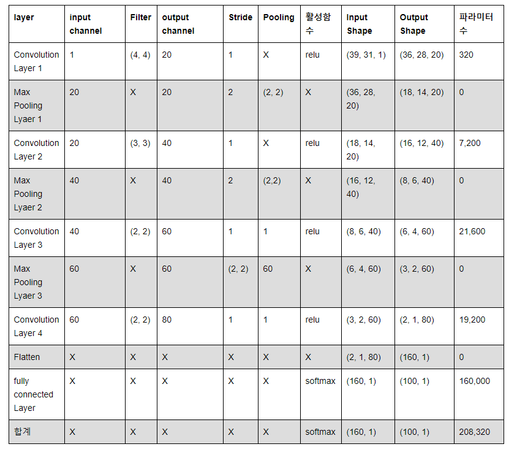

## ■ 파라미터 계산법
- 파라미터 구하는 공식
- **=> 입력채널 x 필터폭 x 필터 높이 x 출력 채널수 + bias**
    - model.add(layers.Conv2D(5, (3,3), padding='same', input_shape=(39,31,1))) 해석
    - -> 1x5x3x3 + bias(5) = 50
- model.add(layers.Conv2D(7, (3,3), padding='same'))
    - -> 5x7x3x3 + bias(7) = 322
- model.add(layers.Conv2D(9, (3,3), padding='same'))
    - -> 7x9x3x3 + bias(9) = 576

## ■ 출력 크기 계산

- 예제 : 패딩(padding) 1, 스트라이드(stride) 1 일때의 출력데이터 크기를 구한 예제

- 풀링 출력 크기

- 예제 모델 구조는 아래와 같다

- 입력 이미지에 shape이 (4,4) 인 필터 20개를 적용할 경우

#### ◆ 1.1 Convolution Layer 
- Convolution Layer1 기본정보
    - 입력 데이터 shape = (39, 31, 1)
    - 입력 채널 = 1
    - 필터 = (4,4)
    - 출력 채널 = 20
    - stride = 1

- 결과 
    - RowSize = N-F / stride + 1 => 39-4/1 + 1 => 36
    - ColumnSize = N-F / stride + 1 => 31-4/1 + 1 => 28
    - 출력맵의 shape는 (36, 28, 20) / 
    - convolution Layer 1에서 학습시킬 대상은 입력 채널 1, 필터 사이즈 (4,4), 출력 채널 20개로 => 학습 파라미터는 320개 (4x4x20)

#### ◆ 1.2 Maxpooling Layer 
- Maxpooling Layer1 기본정보
    - Maxpooling Layer 1의 입력 데이터의 Shape은 (36,28,20) 
    - Maxpooing의 크기가 2x2이므로
    - RowSize = 36/2 => 18
    - ColumnsSize = 28/2 => 14
- 결과
    - 입력 채널 : 20
    - 출력 데이터 shape : (18,14,20)
    - 학습 파라미터 : 0

#### ◆ 2.1 Convolution Layer
- Convolution Layer2 기본정보
    - 입력 데이터 Shape = (18,14,20)
    - 입력 채널 = 20
    - 필터 = (3,3,40)
    - 출력 채널 = 40
    - Stride = 1
    - 입력 이미지에 shape이 (3,3)인 필터 40를 적용할 경우 출력 데이터의 shape는 아래와 같다.
- 결과
    - RowSize = N-F/Stride + 1 => 18-3/1 + 1 => 16
    - ColumnSize = N-F/Stride + 1 => 14-3/1 +1 => 12
    - 입력 채널 : 20
    - 출력 데이터 Shape : (16,12,40)
    - 학습 파라미터 : 7200개 (20x3x3x40)
    
#### ◆ 2.2 Maxpooling Layer 
- Maxpooling Layer2 기본정보
    - Maxpooling Layer 2의 입력 데이터의 Shape은 (16,12,40) 
    - Maxpooing의 크기가 2x2이므로
    - RowSize = 16/2 => 8
    - ColumnsSize = 12/2 => 6
    
- 결과
    - 입력 채널 : 40
    - 출력 데이터 shape : (8,6,40)
    - 학습 파라미터 : 0
    
#### ◆ 3.1 Convolution Layer
- Convolution Layer3 기본정보
    - 입력 데이터 Shape = (8,6,40)
    - 입력 채널 = 40
    - 필터 = (3,3)
    - 출력 채널 = 60
    - Stride = 1
    - 입력 이미지에 shape이 (3,3)인 필터 60개를 적용할 경우 출력 데이터의 shape는 아래와 같다.
- 결과
    - RowSize = N-F/Stride + 1 => 8-3/1 + 1 => 6
    - ColumnSize = N-F/Stride + 1 => 6-3/1 +1 => 4
    - 입력 채널 : 40
    - 출력 데이터 Shape : (6,4,60)
    - 학습 파라미터 : 21600개 (40x3x3x60)
    
#### ◆ 3.2 Maxpooling Layer 
- Maxpooling Layer3 기본정보
    - Maxpooling Layer 3의 입력 데이터의 Shape은 (6,4,60) 
    - Maxpooing의 크기가 2x2이므로
    - RowSize = 6/2 => 3
    - ColumnsSize = 4/2 => 2
    
- 결과
    - 입력 채널 : 60
    - 출력 데이터 shape : (3,2,60)
    - 학습 파라미터 : 0
    
#### ◆ 4.1 Convolution Layer
- Convolution Layer4 기본정보
    - 입력 데이터 Shape = (3,2,60)
    - 입력 채널 = 60
    - 필터 = (2,2)
    - 출력 채널 = 80
    - Stride = 1
    - 입력 이미지에 shape이 (2,2)인 필터 80개를 적용할 경우 출력 데이터의 shape는 아래와 같다.
- 결과
    - RowSize = N-F/Stride + 1 => 3-2/1 + 1 => 2
    - ColumnSize = N-F/Stride + 1 => 2-2/1 +1 => 1
    - 입력 채널 : 60
    - 출력 데이터 Shape : (2,1,80)
    - 학습 파라미터 : 19200개 (2x2x80)
    
#### ◆ 5.1 Flatten Layer 
- CNN의 데이터 타입을 Fully Connected Neural Network의 형태로 변경하는 layer
- Flatten 레이어에는 파라미터가 존재하지 않고, 입력 데이터의 shape 변경만 수행

- Flatten Layer 기본정보
    - 입력 데이터 shape = (2,1,80)
    - 출력 데이터 shape = (160, 1)

#### ◆ 5.2 Softmax Layer
- 이 레이어의 입력 데이터 Shape은 (160, 1)
- 이 네트워크의 분류 클래스가 100개이기 때문에 최종 데이터의 Shape은 (100, 1)

- Softmax Layer 최종 정보
    - 입력 데이터 shape = (160,1)
    - 출력 데이터 shape = (100,1)
    - weight shape (100, 160) 
    - 파라미터 160,000개 (100x160)
    
### ■ 전체 정리

### ■ 참고 문헌
- http://taewan.kim/post/cnn/
