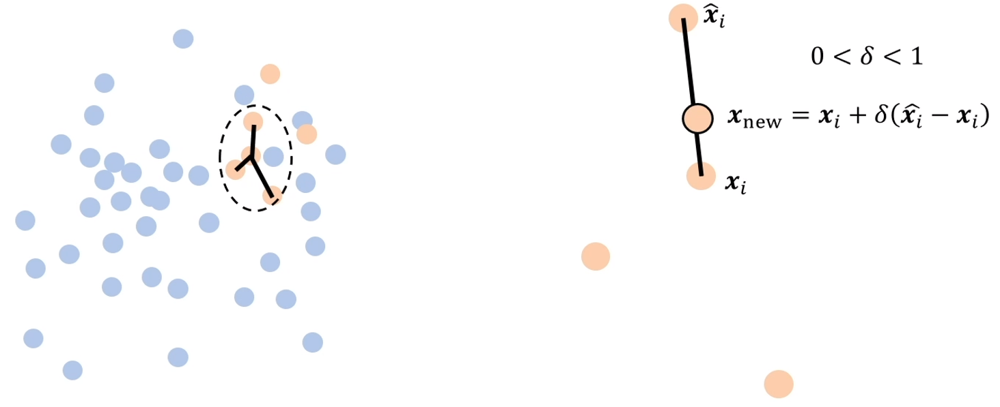
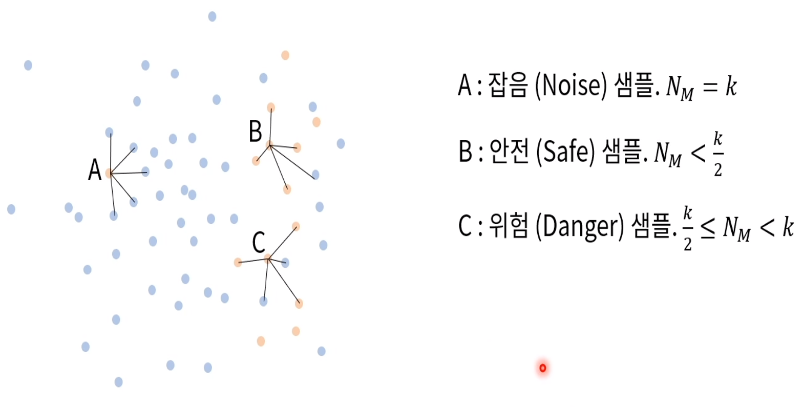

## Imbalanced Data 문제
- Imbalanced data 문제:classification에서 데이터가 어느 한쪽(class, subset)에 치우쳐져 있는 상황
- 라벨이 불균형한 데이터로부터 학습된 분류기는 치우친 결과를 내릴 수 밖에 없게 되는데, 이런 상황을 data가 imbalanced 되었다 라고 합니다.
- 데이터가 많이 존재하는 class : majority class
- 데이터가 적게 존재하는 class : minority class

### imbalanced data 문제 해결법
- 데이터셋 단 해결 방법
    - under-sampling : under-sampling은 majority class에서 적게 샘플링 하는 방법
    - over-sampling : over-sampling은 minority class를 많이 샘플링 하는 방법
- 다만, over-fitting의 위험성 존재

## SMOTE
- SMOTE(synthetic minority oversampling technique)는 여러 응용분야에서 성공적인 결과를 보여준 방법
- K-Nearest Neighbor 중, 랜덤으로 하나의 샘플을 선택하여 Linear Combination을 추가함. 임의 오버 샘플링에 비해 다양한 데이터 추가 됨
- K-NN은 기준 샘플에서 가장 가까운 거리를 가진 K개의 샘플을 말한다. 
    - K : 정수 값 
    - Metric : 특징 공간에서 euclidian거리

### 한계점
- SMOTE에서는 과도하게 발생하는 일반화(over generalization) 문제가 존재
- SMOTE는 주변 샘플에 대한 고려 없이 개별 샘플에 대해 동일한 방법으로 합성 데이터를 생성시키며 -> 이는 부류들 사이에서 중첩 발생(overlapping occurrence)를 증가시킴

## Borderline-SMOTE
- Borderline-SMOTE: A New Over-Sampling Method in Imbalanced Data Sets Learning"(2005), imbalanced data 문제를 해결하기 위한 over-sampling 기법을 제안한 논문 
- **안전한 지역에 있거나, 잡음으로 간주되는 샘플은 오버 샘플링 하지 않고, 위험 지역인 경계(Borderline)에 있는 샘플만 오버샘플링 하여 SMOTE를 효과적으로 수행**

