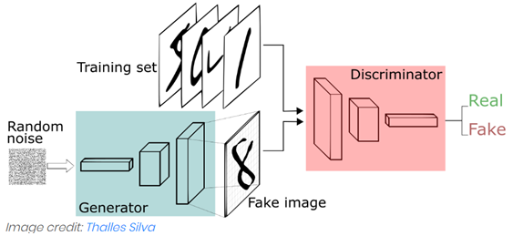
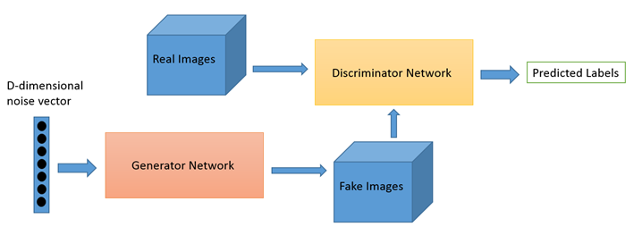

## GAN

### ■ GAN 등장 배경
- DNN의 약점 : 적대적  샘플에 취약하다. 신경망이 잘못된 결과를 산출하도록 의도적으로 조작시킨 입력값 이면 신경망이 전혀 다른 결과로 판정 된다.

### ■ GAN 원리

- GANs은 두 개의 신경망으로 구성되어 있음
- generator라고 불리는 하나의 신경망이 새로운 데이터 인스턴스를 생성
- discriminator는 데이터의 진위를 평가
- **즉 discriminator는 검토한 각각의 데이터 인스턴스가 실제 트레이닝 한 데이터 세트인지 아닌지를 판단하게 된다.**

### ■ GAN 목적
- generator의 입장에서는 생성한 가짜 이미지가 진짜 이미지인것처럼 보여지길 원함
- 반면 discriminator의 목표는 generator로 부터 전달된 이미지를 가짜로 식별하는 것

### ■ GAN 순서
- generator가 임의의 수를 입력받아 생성한 이미지로 반환한다. 
- 이렇게 생성된 이미지는 실제 데이터 세트에서 가져온 이미지들과 함께 discriminator에 전달된다. 
- discriminator는 실제 이미지와 가짜 이미지를 판별하여 0과 1 사이의 확률값으로 반환한다. 
- 1은 실제 이미지, 0은 가짜 이미지를 의미하며, generator는 D(x)=1인 image를 생성하려고 하고, backpropagation으로 학습을 한다.

- **따라서 GAN은 이중 피드백 루프를 갖게 된다.**
    - discriminator는 이미지의 정답 값으로부터 피드백을 받는다. (data의 정답)
    - generator는 discriminator로 부터 피드백을 받는다. ( discriminator)

- **즉 noise Z를 추출하여 이것을 입력으로 generator G image 생성 -> latent feature(숨어있는 특징 – color, shape)를 사용**
- **real image와 generated image를 이용하여 학습하여 어떤 feature가 image를 진짜로 만드는지를 학습함**

### ■ GAN 동작단계
- (1) generator가 데이터 생성
- (2) 실제 data와 합쳐져서 discriminator에 전달
- (3) discriminator는 실제는 1, 가짜는 0에 해당하는 확률 출력
- discriminator (일반적인 CNN) / image -> down sampling -> image 판별
- generator (정반대의 CNN) / random noise vector -> up-sampling -> image 생성

### ■ GAN 트레이닝 팁
- **discriminator를 트레이닝할 때 generator의 파라미터 값을 고정 시키고**
- **generator를 트레이닝할 때는 discriminator의 파라미터 값을 고정시킨다.**
- discriminator와 generator는 각각 고정된 상대 네트워크의 결과값을 통해 학습
- 이로 인해 generator가 반드시 학습해야 하는 gradient를 더 잘 반영할 수 있게 됨

### ■ GAN 문제점
- (1) discriminator가 너무 뛰어나, 0이나 1에 매우 가까운 gradient값을 반환하게 되어, generator가 gradient값을 제대로 반영하기 어려운 경우
- (2) generator가 너무 뛰어나면 discriminator가 진짜 데이터를 가짜 데이터로 판단할 확률이 높아지는 경우
- (3) 이러한 문제는 두 신경망의 학습률(learning rates)을 각각 설정하여 완화할 수 있다. 두 개의 신경망은 항상 비슷한 “학습 수준” 1을 유지해야 한다.
- (4) 모드 붕괴 현상(Mode Collapsing) 
    - 생성기(Generator)와 판별기(Discriminator)를 번갈아 학습을 진행하다보니, 생성기가 특정한 클래스의 데이터만 생성하여 속이려는 경우가 발생
    - 판별기는 생성된 데이터 클래스의 다양성이 부족함을 알고 이 경우 위조라고 판단하게 됨
    - Mini-batch를 통해서 해결 / discriminator가 원본 데이터에 대한 class label을 출력에 포함시키어 생성기 성능 증대.

