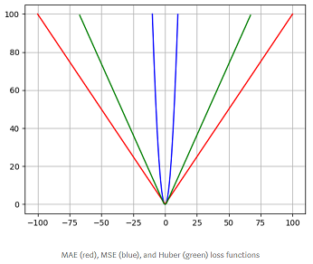

## 0. 신경망 학습이란?
- **현재의 상태를 '하나의 지표(손실함수)'로 표현, 해당 지표를 가장 좋게 만들어 주는 가중치 값을 탐색하는 것**

## 1. 손실함수 (Loss Function)
- Loss Function이란 목표한 파라미터의 최적화에 대한 목적함수
- 일반적으로 '평균 제곱 오차(MSE)'와 '교차 엔트로피 오차(Cross Entropy)'를 사용, 모양이 아래로 볼록한(convex) 모양이 좋음
- Input이 모델 함수를 지나 output을 예측, y_pred 와 실제값 y_true를 loss 함수를 통해 비교, 차이를 이용한 w update
- **Loss Function (Convex 모양) ==> 경사하강법(Gradient Descent)에 의한 최솟값을 찾기가 쉽고(=최적화가 잘 된 다는 것) ==> 특정 가중치가 너무 큰 값을 가질 수 있음 (=학습데이터에 편중된 파라미터로 최적화될 가능성 존재) ==> Regularization penalty) 등장** 

## 2. L1, L2 Loss
- L1 Loss 
    - 실제 값과 예측치 사이의 차이(오차)의 절대값 및 그 오차들의 합
    - 0인 지점에서 미분이 불가능
 

    
    
- L2 Loss
    - 오차의 제곱 합
    - 오차의 제곱이기 때문에 Outlier에 더 큰 영향을 받음
    

## 3. Regression Loss Function

### 3-1. Mean Absolute Error (MAE)
- MAE도 Convex 모양

### 3-2. Mean Squared Error (MSE)
- 오차를 모두 제곱한 다음에 평균 낸 것

### 3-3. MAE vs MSE
- MAE의 경우, loss가 크던 작던 항상 gradient가 일정, 
- Loss가 작아도 gradient는 작지 않기 때문에 경사하강법(gradient descent)를 사용해 최적값을 찾는 데에 어려움이 존재
- MSE는 loss가 크면 gradient도 크고, loss가 작으면 gradient도 작기 때문에 최적값을 찾는 것이 보다 수월

### 3-4. Huber 손실 (후버손실)
- MSE 와 MAE의 절충안
- 일정한 범위(델타)안에 있으면 오차를 제곱, 밖에 있으면 오차의 절댓값 사용

## 4. Classification Loss Function
### 4-1. Binary Cross Entropy 
- 이진 분류시 사용.
- 손실함수는 예측값과 실제값이 같으면 0이 되어야 한다. 
    - 예측값과 실제값이 1로 같을 때 loss는 0
    - 예측값이 0 실제값이 1이면 loss는 +Inf
- torch.nn.BCELoss / torch.nn.BCEWithLogitsLoss(멀티 Label 용, 각각의 클래스에 대한 binary cross entropy)
    - torch.nn.BCEWithLogitsLoss = torch.nn.BCEWithLoss + torch.sigmoid

### 4-2. Categorical cross-entropy
- 멑티 클래스 분류 시 사용
- **라벨이 [0,0,1], [1,0,0], [0,1,0] 처럼 one-hot 형태로 제공될 때 사용**
- torch.nn.CrossEntropyLoss

### 4-3. Sparse categorical cross-entropy
- 멀티 클래스 분류 시 사용
- **라벨이 one-hot이 아닌 0,1,2,3,4 와 같이 정수의 형태로 제공될 때 사용**

### 4-4.
- (4) 기타
    - Hinge
    - Squared Hinge
    - Categorical Hinge
    - nn.KLDivLoss
    - nn.GaussianNLLLoss
    - nn.SoftMarginLoss

### ■ 참고문헌
- https://www.youtube.com/watch?v=kuJROoa4kh8
- https://www.tensorflow.org/api_docs/python/tf/keras/losses // keras loss
- https://pytorch.org/docs/stable/nn.html#loss-functions // pytorch loss
- https://bo-10000.tistory.com/44
- https://light-tree.tistory.com/125#:~:text=5.-,L1%20Loss,%EC%9D%84%20L1%20Loss%20%EB%9D%BC%EA%B3%A0%20%ED%95%A9%EB%8B%88%EB%8B%A4.
- https://towardsdatascience.com/understanding-the-3-most-common-loss-functions-for-machine-learning-regression-23e0ef3e14d3
- http://doc.mindscale.kr/km/data_mining/dm02.html
- https://bskyvision.com/822