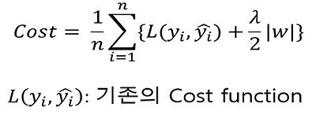
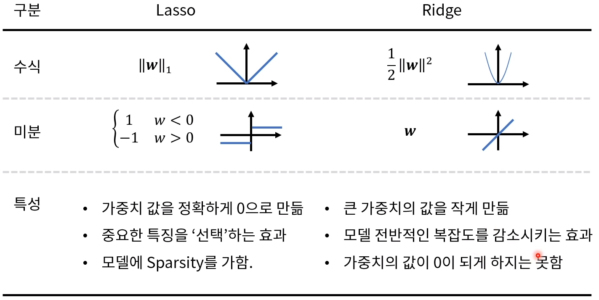

# 오버피팅 방지법 - L1, L2

## 1. 규제화(Regularization) 기법
- **규제화의 목적은 오버피팅을 줄이는 것**
- 모델 복잡도에 대한 패널티로 정규화는 Overfitting 을 예방하고 Generalization(일반화) 성능을 높임이 목적
- Regularization 방법
    - L1 Regularization, L2 Regularization
    - Dropout
    - Early stopping

- 오차 함수를 오차(error) 항과 모델 복잡도(model complexity) 항으로 정의
    - Loss에 집중 : 학습데이터에 대한 신뢰도가 높음. 
    - 학습 데이터에 속하지 않은 입력에 취약
    - Complexity를 낮춤 : 모델의 복잡도가 지나치게 높아지지 않도록 제약.
    - 모델이 복잡하면 Overfitting 이니까 성능을 좀 떨구는 것 + Cost를 높여서

## ■ L1, L2 (정규화, Loss, Regularization)

### L1, L2 Norm
- L1 Norm(Mahattan Distance, Taxicab geometry)
    - L1 Norm은 두 개의 벡터를 빼고, 절대값을 취한 뒤, 합한 것 (가로, 세로)
    - ex) x=(1,2,3), y=(-1,2,4)라면 d(x,y)=|1-(-1)|+|2-2|+|3-4|=2+0+1=3

- L2 Norm(Euclidean Distance, 직선거리)
    - L2 Norm은 두 개의 벡터의 각 원소를 빼고, 제곱을 하고, 합치고, 루트를 씌운 것
    - ex) x=(1,2,3), y=(-1,2,4)라면 d(x,y)=root(4+0+1)=root(5)

- L1 Norm 은 빨간색, 파란색, 노란색 선으로 표현 될 수 있음
- L2 Norm 은 오직 초록색 선으로만 표현될 수 있습니다.
- L1 Norm 은 여러가지 path 를 가지지만 L2 Norm 은 Unique shortest path 를 가진다

### L1, L2 Loss
- L1 Loss
    
    - L1 Loss는 두 개의 벡터가 들어가던 자리에 실제 타겟값(y_true)와 예측 타겟값(y_pred)가 들어감
    - MAE Loss, 중간값의 특성을 띔
    - L1 Loss는 L2 Loss에 비해 이상치(Outlier)의 영향을 덜 받는 Robust 한 특성가짐 
    - 0에서 미분이 불가능합니다. (0이 발생해서, L2는 0 발생X)
    
- L2 Loss
    
     - l2 norm 과 비슷하지만, 루트를 취하지 않는다는 차이가 있음
     - MSE Loss
     - 오차의 제곱합 = Least Squares Error(LSE, 최소자승법)로도 불립니다.
     - 이상치가 들어오면 오차가 제곱이 되어 이상치에 더 영향을 받습니다. 

- **L1 Loss 가 L2 Loss 에 비해 Outlier 에 대하여 더 Robust(덜 민감 혹은 둔감) 하다.**
- **Outlier가 적당히 무시되길 원한다면 L1 Loss 를 사용하고, Outlier 의 등장에 신경써야 하는 경우라면 L2 Loss 를 사용**

### L1, L2 Regularization
- L1 Regularization
    - L-1 Norm을 최소화 하는 방법
    - 가중치의 절대값에 패널티를 줌
    - 값이 양수 또는 음수로 존재하면 줄이려 함 -> V자형 그래프인데 0으로 줄임 
    - 0이 많아지다보니 W에  값이 희소해지는 특성이 있음. 
    - 라플라스 분포
    
    - 회귀에서 L1 규제가 사용되면 Lasso 회귀

- L2 Regularization
    - L-2 Norm을 최소화 하는 방법
    - 아주 큰 가중치에 대해 패널티 부여(1/2로 나누니까)
    - 이차함수 기준 1/2로 나누다 보니까 더 구불구불한 것보다 더 평평한 형태를 선호
    - 베이지언 사전 확률 분포 / 가중치가 정규분포의 형태를 이루도록 함
    
    
    - 람다 값이 크면 가중치는 정규 분포에 가깝게 나타나고, 0에 가까울수록 정규화(정규분포처럼)가 이루어지지 않고 평평한 분포임
    - 회귀에서 L2 규제가 사용되면 Ridge 회귀

- L1 같은 경우는 작은값을 0으로 바꿔주기 때문에 좀더 모이는 현상이 나타나고
- L2 같은 경우는 큰값을 줄이기 때문에 좀더 퍼지는 현상이 나타난다

### Lasso vs Ridge 

- 특성 해석 : 
    - 가중치 값을 0으로 많이 나옴
    - 중요하지 않은건 0으로 만들다보니 중요한 특징이 부각
    - Sparsity가 가해져서 모델이 보다 압축될 수 있는 가능성이 생김
- Ridge 특성 해석
    - 큰 가중치의 값을 작게 만듦
    - 가중치의 값이 0이 되게 하지는 못함. 일반적으로 기울기가 대각선이니까
    

## 2. Dropout 기법
- 훈련시 일정 확률로 임의의 뉴런을 골라 삭제하여 신호를 전달하지 않게 함.
- 미니배치(mini-batch)나 학습주기(epoch) 마다 드롭아웃할 즉, 없는 것으로 간주할 노드들을 새롭게 선택하여 학습 
    - -> **매번 새롭게 학습해서 다양한 신경망을 학습한 것처럼 함**
- 추론을 할 때는 드롭아웃을 하지 않고 전체 학습된 신경망을 사용하여 출력 계산 (드롭아웃은 학습할때만, 추론할떄는 안함)
- 각 훈련마다 은닉 유닛을 무작위로 선택하기 때문에 매번 다른 모델 구조를 얻게 됨. 하나의 신경망 안에 다수의 부분 신경망이 학습된 것과 같은 효과 = 앙상블과 같은효과

## 3. 배치 정규화 기법
- 학습 데이터가 큰 경우에는 미니배치 단위로 학습 
- 미니 배치에 속하는 각 데이터의 그레디언트의 평균 사용
- 미니 배치 학습 시 내부 공변량 이동문제(internal covariate shift)문제
    - 이전 층들의 학습에 의해 가중치가 바뀌어져 있음.
    - 현재 층에 전달되는 데이터의 분포가 현재 층이 학습했던 시점의 분포와 차이가 발생
    - 학습을 다시 되돌리듯이 진행됨 
    - ==> **배치정규화의 등장**
- 배치 정규화 사용시 장점
    - 가중치 초기값에 크게 영향을 받지 않음 -> 분포 상관없으니 초깃값 설정에 크게 신경쓸 필요가 없어짐
    - 학습률을 아주 작게 설정할 필요도 없어, 학습이 빨리 진행되는 경향을 보인다.
    - 또한 과적합을 억제하는 특성이 있어서, 드롭아웃을 사용하지 않아도 성능이 좋은 신경망 모델이 학습될 수도 있음.

## 4. 훈련(train), 검증(valid) , Kfold
- 데이터를 더 확보해서 train 과 valid 검증 작업을 거침
- 홀수로 K-Fold를 거침

### 참고문헌
- https://light-tree.tistory.com/125 [All about]