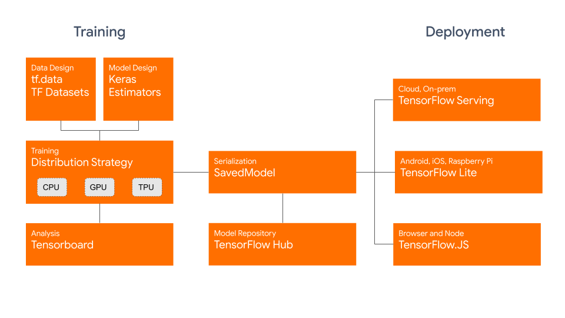
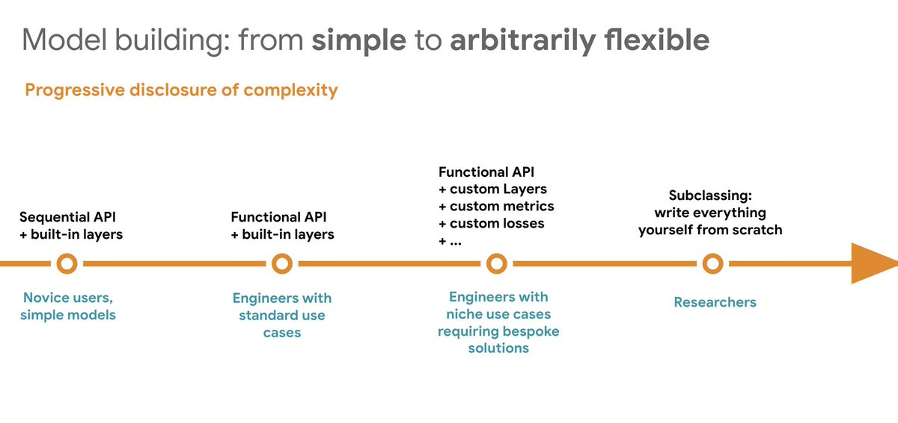

### 텐서플로우 2.0 공부

### ■ 텐서플로우란
- 텐서란 다차원 배열. 
- ndarray 객체와 비슷하며, tf.Tensor 객체는 '데이터 타입'과 '크기'를 가지고 있습니다. 

### ■ tensor vs numpy
- 텐서는 가속기 메모리(GPU, TPU)에서 사용할 수 있음.
- 불변성(immutable)을 가짐.
- 넘파이와의 호환성
    - 텐서플로 연산은 자동으로 넘파이 배열을 텐서로 변환함 (함수 안에 numpy 넣어도 됨)
    - 넘파이 연산또한 자동으로 텐서를 넘파이 배열로 변환함
- 'tf.Tensor는 GPU 메모리에 저장'될 수 있고, '넘파이 배열은 항상 호스트 메모리에 저장' 
- 즉 Tensor <-> Numpy 배열간의 변환이 항상 가능한 것은 아니며, 특정 경우 GPU에서 호스트 메모리로 복사가 필요함
- tensorflow와 numpy 는 모두 선형대수학의 Element-wise 방식 벡터 연산을 제공함. = 벡터단위 계산

### ■ Tensorflow 1.xx vs 2.xx

- Define and Run 방식 (Session 을 따로두고 그래프를 만들어서 실행 하는 것)
- C++ core / Python API
- Theano 기반으로 Tensorflow 가 만들어졌음. Theano 개발자들이 많이 Tensorflow 개발에 참여함
- 가장 큰 경쟁자들이 Pytorch, CNTK, MxNet 등 / 2019년 10월 2.0 Release
- Pytorch의 Define By Run 방식을 따라감. (바로바로 실행되는 것)
- **그래프 모드를 버렸지만 잃게 된건 속도임. 대신 속도를 보완하기 위해 AutoGraph 라는 다시 그래프로 돌아갈 수 있음**
- high level 에는 Keras만 남고 나머진 다 없어짐(slim 등) (통일 시켜버림)
- keras 담당자도 tensorflow backend만 하겠다라고 함
- Keras는 기본적으로 그래프 모드로 돔. 그래서 그냥 써도 빠름 속도가
- import tensorflow.compat.v1 as tf -> tf 1 version 쓰는 법.
- tf.layers -> tf.keras.layers ==> 무조건 됨 ! (layers를 그냥 바로 가져다 씀)
- 속도적인 측면에서는 tf 보단 mxnet? 이 많고, pytorch를 쓰는게 코딩하기가 좀더 쉬움, 연구자들이 그래서 low level만지기가 쉬워서 그렇다구 함. (근데 막 그렇게 비교될정도는 아님 ㅋ)

### ■ Tensorflow 2 Structure Concept
- 모델을 Saved Model 이란 API로 통합함. -> Browser and Node, / TensorFlow Lite (안드로이드, IOS, Arduino and more)
- Tensorflow Serving(Cloud on prem)

- @tf.function 태그를 붙이면 graph 모드로 돌아감.  (상위 함수 하나에만 해도됨)
- @for while -> tf.while_loop / if -> tf.cond 등으로 알아서 해줌.

### ■ 단계별 Tensorflow Engineering
- (1) Sequential API 
    - 기존의 tf.keras.layers
    - model.add(tf.keras.layers.Dense(10, activation='softmax') 등등
    - Functional API 가 좀더 세부적으로 보다 Inception 과 같은 복잡한 구조를 만들수 있음
- (2) Functional API
    - **Input과 Output 을 다 기술한다음에 한번에 model 로 넣는 것.**
    
    - input = tf.keras.Input(shape=(784, ), name='img')
    - h1 = tf.keras.layers.Dense(64, activation='relu')(inputs)
    - h2 = tf.keras.layers.Dense(64, activation='relu')(h1)
    - output - tf.keras.layers.Dense(10, activation='softmax')(h2)
    - model = tf.keras.Model(input, output)

- (4) Custom model API
    - init 는 모델 사용할 거 선언하고
    - call에서 그 모델들을 불러와서 구체화해주는 것
    

### ■ 단계별 Tensorflow Fit
- (1) model.fit() : 가장 기본적인
- (2) model.fit() + callback : 콜백기능 추가
- (4) tf.GradientTape() : 가장 어려운, model의 입력부터 loss 등까지 다 테이프에 기록

