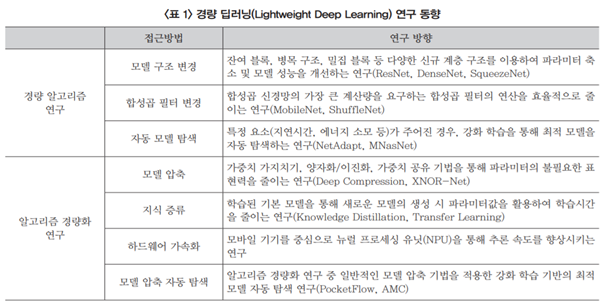
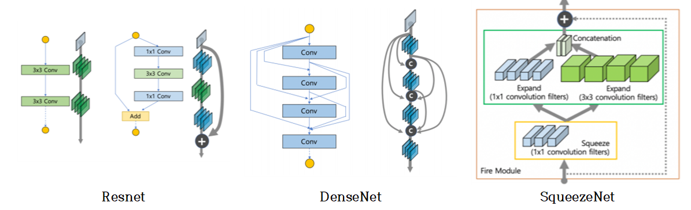
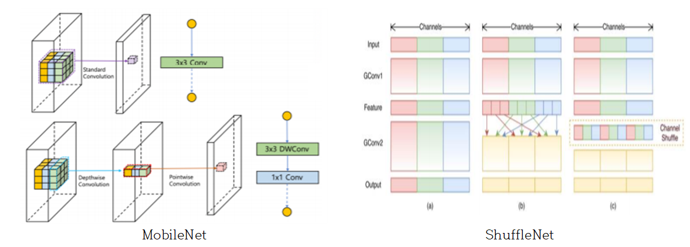
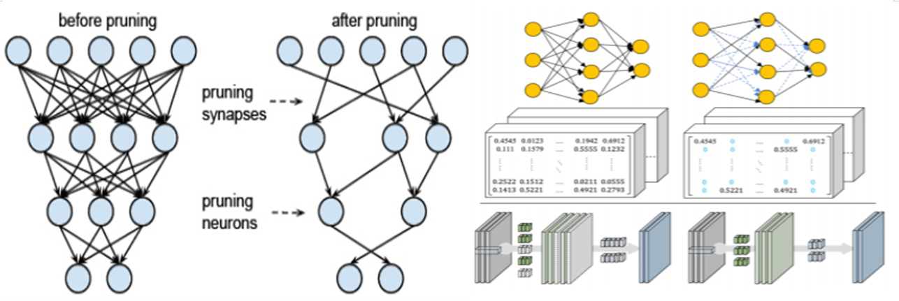
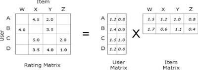
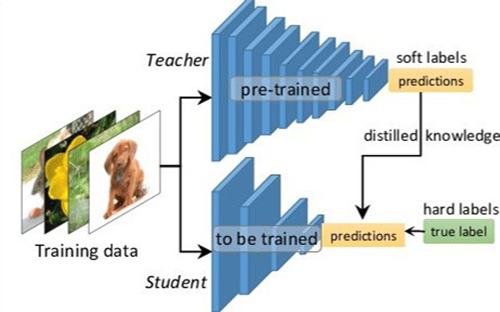

### 딥러닝 경량화 (Lightweight_DeepLearning)

## ■ Deep Neural Network의 역사 (2012년 CNN의 등장 이후부터)
- 2010년부터 시작된 이미지분류대회 (ImageNet Large-Scale Visual Recognition Challenge, ILSVRC)는 무려 1,000개가 넘는 카테고리로 분류된 100만개의 이미지를 인식하여 그 정확도를 겨루는 대표적인 시각지능 대회이다. 2012년 대회 이전까지는 기계의 이미지 인식률이 75%를 넘지 못했었으나, 2012년 이미지넷에 출전한 캐나다 토론토대학의 알렉스가 인간의 뇌 구조를 본 딴 인공신경망 모델은 나선형신경망(Convolution Neural Network, CNN)을 구현하여 들고 나왔고 84.7%라는 놀라운 정확도를 내보였고, 이는 죽어있던 딥러닝 인공지능의 부활 신호탄을 쏘게 된다. 
- 이후 Deep Neural Network가 이미지 분류에 탁월한 성능을 보인다는 것이 많은 사람들에게 알려지면서 많은 연구자가 딥러닝 인공신경망에 관심을 가지게 되었고, 2014년 VGG( 19Layer), GoogleNet(22Layer)으로 더 깊은 Layer를 가진 신경망이 나타나고, 2015년 ResNet(Neural Network의 Layer 수가 일정수준 이상으로 많아지는 경우 Loss의 Gradient 역전파가 잘 안되는 문제를 해결함)을 통해 더 깊게 Layer를 쌓는 것이 가능해졌고, 무려 152 Layer를 쌓아 올린 Neural Network를 구성하게 된다. 이 때 Resnet의 오류율은 3.57%로 인간의 오류율이 5.1%라는 것을 고려했을 때 인간보다 우수한 정확도를 보였다고 평가할 수 있다.
- 2016년 DenseNet은 ResNet에서 아용된 Gradient 전달경로를 층마다 더 촘촘히 두어 Loss의 Gradient가 더 잘 전달되도록 하는 구조를 제안하며 121, 169, 201, 264개의 Layer를 제안한다.

## ■ 경량화의 필요성 및 방법
- 최근 들어, 이미지, 소리, 텍스트 형태로 이루어진 무한한 양의 빅데이터를 이해하기 위하여 강력한 GPU기반의 컴퓨팅 자원을 바탕으로 학습을 통해 다양한 딥러닝 모델이 만들어지지만, 경량 디바이스, 모바일 디바이스, 산업용 게이트웨이, IoT센서와 같은 디바이스에서 직접 학습과 추론이 가능할 정도의 수준은 미미하여, 실제 지능형 디바이스로 변화하기에는 역부족이다. 이러한 추세로 기존의 학습된 모델의 정확도를 유지하면서 보다 크기가 작고, 연산을 간소화하는 연구인 경량 딥러닝 연구과 필요하다. 위에 설명한 Neural Network들은 매우 깊은 layer구조와 수백 MB를 넘을 정도로 많은 수의 파라미터를 갖고 있기 때문에 학습시뿐만 아니라 추론시에도 많은 연산이 필요하다. 그래서 실시간 처리가 필요한 응용 애플리케이션 또는 모바일 환경 등과 같이 리소스 사용에 제한이 있는 경우에는 연산에 필요한 자원이 부족할 수 있으므로, 이러한 경우 더 적은 연산량으로 추론을 수행할 수 있도록 해 주어야 한다. 
- 경량 딥러닝 기술은 알고리즘 자체를 적은 연산과 효율적인 구조로 설계하여, 기존 모델 대비 효율을 극대화하기 위한 경량 딥러닝 알고리즘 연구와 만들어진 모델의 파라미터들을 줄이는 모델 압축등의 기법이 적용된 알고리즘 경량화 기술로 나눌 수 있다.

## ■ 경량 알고리즘 연구 - 모델 구조 변경 기술
### (1) Resnet (레즈넷)
- 깊은 신경망의 문제는 층의 수가 늘어나면서 점차 정확도가 저하되는 문제가 발생 (gradient vanishing)
- F(x)를 최소화 한다는 가정안에 입력과 출력의 잔차를 F(x) = H(x) - x 라고 정의하고, 이 잔차F(x)를 찾고 F(x)를 학습하는 것.

### (2) DenseNet (덴스넷)
- 네트워크 전체를 몇 개의 DenseBlock으로 나눠서 같은 feature map size를 가지는 레이어들은 같은 dense block내로 묶음. 
- 쉽게 말해서 입력값을 계속해서 출력값의 채널 방향으로 합쳐주는 것으로 Resnet과의 차이점은 Resnet은 입력이 출력에 더해지는 것이기 때문에 종단에 가서는 최초의 정보가 흐려지는 반면 DenseNet의 경우에는 채널 방향으로 그대로 합쳐지기 때문에 최초의 정보가 비교적 온전히 남아있게 된다.

### (3) SqueezeNet (스퀴즈넷) 
- 더 작은 모델 사이즈로 동일한 성능을 내기 위한 모델로 FireModule을 통해 필터크기를 1x1로 줄이고, 이로 인한 정확도 손실을 보완하는 레이어를 추가함.

## ■ 경량 알고리즘 연구 - 효율적인 합성곱 필터 기술
### (1) MobileNet (모바일넷)
- 합성곱 필터를 채널단위로 먼저 합성곱(Depth Convolution)을 하고, 그 결과를 하나의 픽셀(Point)에 대하여 진행하는 합성곱(Pointwise Convolution)으로 나눔으로써 한 예로, 필터의 가로, 세로 길이를 3이라고 할 때, 약 9배의 이득이 있게 하였다.
- Depthwise Convolution와 Pointwise Convolution으로 구분하는 DSC(Depthwise Separable Convolution)기법사용

### (2) ShuffleNet
- DSC기반으로 파라미터를 줄였지만 1x1 Convolution은 여전히 많은 파라미터를 갖는다.
- 그래서 Pointwise Convolution의 추가적인 개선을 위해 Group Convolution(채널을 몇 개의 그룹으로 나누어, 각 그룹별로 컨볼루션을 진행하면, Group Convolution을 통해 파라미터를 줄일 수 있지만, 정보가 그룹 단위로만 연결되어 그룹 간에 연관성을 반영하지 못하는 문제가 발생. 따라서 1x1 Convolution을 또 다시 그룹수만큼 나누어 셔플하여 그룹간에 정보를 공유하게 되어 Group Convolution의 단점을 극복하고, 적은 파라미터로 높은 성능을 낼 수 있다.
- 즉 Group Convolution 기법 + 셔플(Shuffle) 기법을 더한 것 (13배 성능 향상)

## ■ 알고리즘 경량화
### 1) Neural Network Pruning (가중치 가지치기)
- Neural Network의 파라미터 중에서 중요도가 떨어지는 파라미터를 찾아 제거하는 방법으로, 학습을 시작할 때는 몇 개의 파라미터를 사용하는 것이 최적인지 알 수는 없기 때문에, 충분한 수의 파라미터를 사용할 수 있도록 Neural Network를 구성하고, 학습을 완료한 후에 결과에 영향이 적은 파라미터를 선택하여 Neural Network로부터 제거 한다. 영향도가 적은 파라미터라 하더라도 제거시에 정확도 손실이 발생 할 수 있는데, 이러한 정확도 손실을 보정하기 위하여 Pruning을 한 상태에서 다시 추가 학습을 하거나, Grouping 하여 Pruning하는 방법 등 적절한 수준에 도달할 때까지 제거와 추가 학습을 여러 차례 반복하기도 한다.

### 2) Low-Rank Approximation
- CNN(Convolutional Neural Network)에서의 많은 양의 Convolution 연산을 하게 되는데, 일반적으로 4차원 데이터와 3차원 Filter-Bank간 Convolution을 수행하게 된다. Convolution연산은 행렬 곱셈을 통해 연산이 이루어 지는데, Low-Rank Approximation에서는 행렬 곱 연산시 Rank를 줄여 연산함으로써 근사해를 구하더라도 더 빠른 속도로 연산을 할 수 있게 된다. Rank를 줄이기 위해 SVD(Singular Vector Decomposition)이나, 4차원 데이터와 3차원 Filter-Bank의 형태나 특성을 고려하여 Rank를 줄이는 방법 등 다양한 알고리즘들이 연구되고 있음.

####  => 쉽게 말해서 더 빨리 쉽게 계산하기 위해 행렬을 바꾸는 것

### 3) Quantization (양자화) 및 Binarization(이진화)
- Neural Network를 구성하여 학습, 추론해 보면 파라미터를 위하여 32bit 또는 64bit 부동 소수점 수준의 Precision이 필요하지 않은 경우가 많이 있다. 
- Quantization은 파라미터 Precision을 적절히 줄여서 연산 효율성을 높이는 방법이다.
- 16bt, 8bit Precision을 사용하는 방법의 경우, 비교적 적은 정확도 손실로 고속 연산이 가능한 경우가 많아서, 좀더 과감하게 4bit, 2bit, 1bit를 사용하는 알고리즘이나, 신경망이 가지고 있던 가중치(Weights)와 층 사이의 입력을 부호에 따라서 minus 1 혹은 +1의 이진형태의 값으로 변환하는 방법도 있다.

 

### 4) Knowledge-Distillation (지식 증류 기술)
- Knowledge-Distillation은 Teacher Network로부터 Student를 학습시키는 모델로 Teacher-Student Network로 언급되r도 한다. 학습하고자 하는 DataSet D가 있을 때 Teacher Network T가 Dataset D를 먼저 학습하고 그 후 Teacher Network보다 작은 규모의 Student Network S가 Teacher Network T를 활용하여 Dataset D를 학습하게 된다. 
- 이 과정을 Distillation이라는 용어로 표현하는데, 이는 Teacher Network T가 Studnet Network S에게 Dataset D에 관한 지식을 응축하여 전달하는 것이라고 할 수 있다. 이렇게 학습된 S는 T를 거치지 않고 D를 직적 학습한 D 보다 더 높은 성능을 가진다.
- 즉 큰 Neural Network인 Teacher Network T의 지식이 작은 Neural Network인 Student Network S로 Distillation 되었다고 하여 Knowledge-Distillation이라고 한다.
- T의 지식을 S로 어떻게 전달 할 것인가에 대해 관해서도 다양한 연구가 진행되고 있다.

### 5) 하드웨어 가속화 기술
- 벡터/행렬 연산을 병렬 처리하기 위한 전용 하드웨어 TPU(Tensor Processing Unit), On-Device AI응용 추론을 위한 전용 VPU(Visual Processing Unit) 프로세스 및 GPU Cluster 기반 가속기 등의 연구 개발이 주요 IT기업에 의해 주도되고 있다.
- 인텔의 모비디우스를 통한 Neural Compute Stick / 엔비디아의 잭슨 TX2 / 구글의 엣지 TPU / 모바일 환경의 퀼컴의 스냅드래곤 / 삼성의 액시노스 등이 있다.

## 자료(이미지 등) 출처
- ETRI 경량 딥러닝 기술동향 https://ettrends.etri.re.kr / 2019 Electronics ans Telecommunications Trends
- AI와 융합을 위한 차세대 디바이스 기술 동향 (임태규 삼성전자 선임연구원 / 박재웅 현대오토에버 대리)
