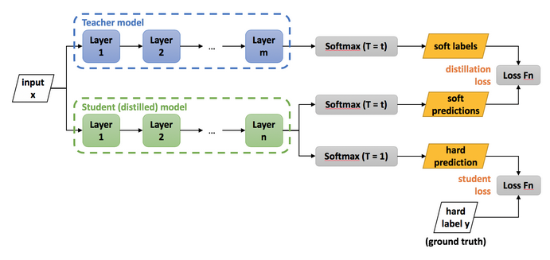
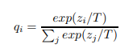
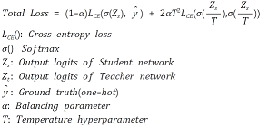
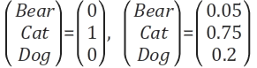
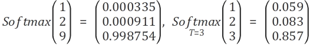
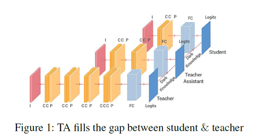
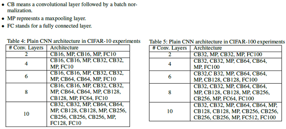

## 지식증류 (Knowledge Distillation)

### ■ 지식증류란?
- 딥러닝에서 지식 증류(Knowledge-Distillation)는 큰 모델(Teacher Network)로부터 증류한 지식을 작은 모델(Student Network)로 transfer하는 일련의 과정으로 Teacher-Student Network로 언급되기도 함
- (Distillation 증류 과정)학습하고자 하는 Dataset D가 있을 때 Teacher Network T가 Dataset D를 먼저 학습한 후 Teacher Network보다 작은 규모의 Student Network S가 Teacher Network T를 활용하여 Dataset D를 학습

- **이렇게 학습된 Student Network S는 Teacher Network T 없이 Dataset D를 직접 학습한 S’보다 더 높은 성능을 보인다는 것이 여러 논문을 통해 확인되었습니다. (정확도는 낮더라도 전체적인 효율상으로는 좋아진 다는 것**

### ■ Knowledge Distilliation 논문 1
- **Distilling the Knowledge in a Neural Network** - Geoffrey Hinton, Oriol Vinyals, Jeff Dean

### ■ 모델구조

### ■ T 값 이해하기
- Neural Net은 Class의 확률을 소프트맥스 Output Layer을 이용해서 예측함.
- T 는 Temperature 라고 부르는데 Softmax 함수가 입력값이 큰 것은 아주 크게, 작은 것은 아주 작게 만드는 성질을 완화해줍니다.
- T가 1이면 0, 1의 binary화된 결과값을 얻는데 이는 확률분포를 알기 어렵게 만듬
- T가 클수록 더 soft한 확률 분포가 클래스마다 만들어지게 됨
- soft하다는 것은 결과값이 천천히 증가한다는 뜻입니다. 하지만 T가 너무 커지면 모든 클래스의 확률이 비슷해집니다.
    - example)
        - 1. a = [0, 1, 2 ,3 4]
        - 2. Softmax_a = [0.011, 0.031, 0.086, 0.234, 0.636]
        - 3. Distilled_a(T=3) = [0.092, 0.128, 0.179, 0.250, 0.349]

### ■ 수식

### ■ Hard Label vs Soft Label

- 곰, 고양이, 개 3가지 클래스를 구분하는 모델이 있을 때, 분류 결과가 왼쪽과 같다면 Hard label, 오른쪽과 같다면 Soft label 
- **입력 이미지에서 고양이와 개가 함께 가지고 있는 특징들이 어느정도 있었기 때문에 Dog class score 가 0.2 만큼 나왔다고 생각할 수 있음** 
- **결과값을 Hard label 로 표현하면 이런 정보가 사라진다.**

### ■ Knowledge Distilliation 논문 2
- **Improved Knowledge Distillation via Teacher Assistant** - Seyed-Iman Mirzadeh, Mehrdad Farajtabar, Ang Li, Nir Levine, Akihiro Matsukawa, Hassan Ghasemzadeh

### ■ 모델구조

- 저자는 기존의 Knowledge Distillation 의 Teacher, Student(이하 T, S) 관계 사이에 중간 크기의 모델인 Teacher Assistant(이하 TA) 모델을 사용하여 여러번 Distillation 을 반복하면 S 의 성능을 더 높일 수 있음을 보여주고 있습니다.

### ■ 실험내용
- CNN 과 ResNet 을 사용하여 실험을 진행, ResNet은 ResNet 논문에서 제시한 형태 그대로를 사용하고, CNN 은 아래와 같이 데이터셋 별로 2개의 모델 구조를 가지고 실험
- **저자는 S 의 layer 수를 2개로 고정하고 T 의 layer 수를 4, 6, 8, 10 으로 늘려가며 S 의 성능을 관찰**

### ■ 실험결과 (TA 생성배경)

- **T 가 일정 수준 이상으로 커지면 T 의 성능은 좋아지지만 S 의 성능은 오히려 떨어지는 모습을 보여주며, T의 크기가 큰 것이 S 의 좋은 성능을 보장하지 않음**

    - (1) 충분히 큰 T 를 사용하여 S 의 성능을 높이고 싶으나,
    - (2) T 와 S 의 차이가 클 경우 S 가 T 를 잘 mimicking 하기엔 capacity gap 이 너무 벌어지고
    - (3) T 가 더 정확해질수록 T 의 soft label output 이 점점 hard label output 처럼 변해 문제가 생김.
- ==> **따라서 1 을 만족하면서 2, 3 을 해소하기 위해 T 와 S 사이에 T 보다 작은 TA 를 넣어 T → TA 로 Distillation 하여 잘 학습된 TA 를 만들고, 다시 TA → S 로 Distillation 하여 최종적으로는 좋은 성능의 S 를 만듬**

## 소스코드 링크
- https://github.com/lsh3163/TF-2.0-Knowledge-Distillation

### 참고링크
- https://arxiv.org/abs/1503.02531 // Distilling the Knowledge in a Neural Network - Geoffrey Hinton, Oriol Vinyals, Jeff Dean
- https://light-tree.tistory.com/196 // KD 모델 
- https://tobigs.gitbook.io/knowledge-distilation/untitled-1 // KD 모델 
- https://post.naver.com/viewer/postView.nhn?volumeNo=20748771&memberNo=36733075

- https://arxiv.org/abs/1902.03393 // Improved Knowledge Distillation via Teacher Assistant- Seyed-Iman Mirzadeh, Mehrdad Farajtabar, Ang Li, Nir Levine, Akihiro Matsukawa, Hassan Ghasemzadeh
- https://light-tree.tistory.com/198 // TA 모델

### 향후 참고 문서
- https://ezobear.github.io/model%20compression/2020/01/02/KD-post.html // KD 논문 흐름 전체 정리