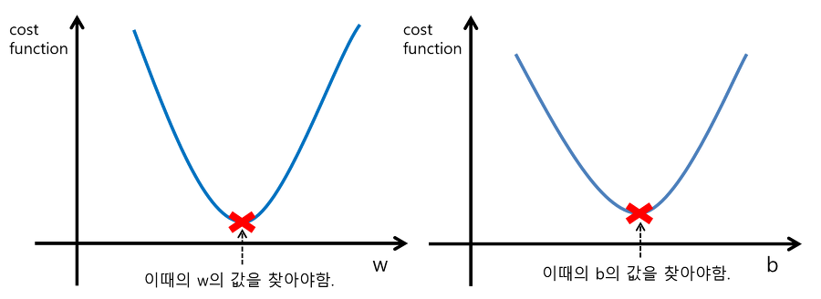

## ■ 경사하강법 (Gradient Descent)
- 경사 하강법(傾斜下降法, Gradient descent)은 1차 근삿값 발견용 최적화 알고리즘이다. 기본 개념은 함수의 기울기(경사)를 구하여 기울기가 낮은 쪽으로 계속 이동시켜서 극값에 이를 때까지 반복시키는 것이다.(위키백과 정의)

- 경사하강법의 목표는 전역 최댓값에 도달하는 것으로 머신러닝 모델에서 흔히 사용되는 **최적화 기술**이다.

- 비용함수가 convex 함수

- 비선형 활성화 함수를 사용하는 ANN 은 극솟값을 가지기 때문에 가능하다. (선형일 경우는 극솟값이란게 존재 x)

- 경사하강법을 사용할 때는 ㅁ모든 특성이 같은 스케일을 갖도록 만드는게 좋음

- cost function이 y축이며 w가 x축 -> 가중치에 따라 비용이 최소가 될 때를 찾아야 됨

