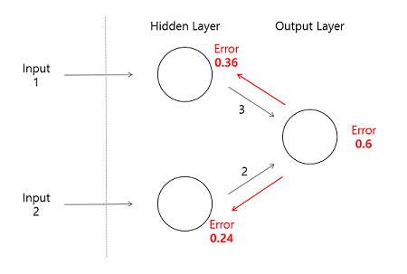
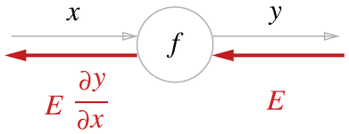
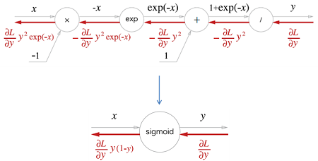
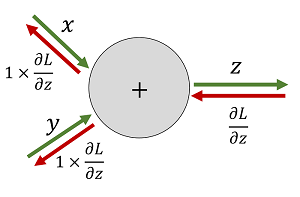
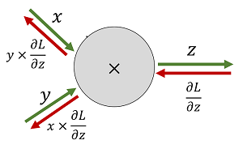
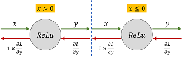
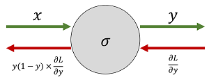
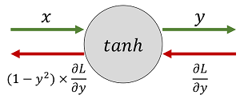
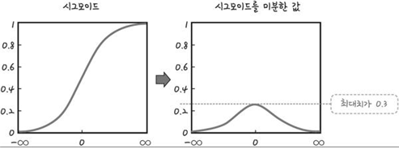

## 오차역전파와

### ■ 오차역전파란
- Input이 들어오는 방향(순전파)으로 output layer에서 결과 값이 나오는데, 결과값은 오차(error)를 가지게 되는데 역전파는 이 오차(error)를 다시 역방향으로 hidden layer, input layer 에게 오차를 다시 보내면서 가중치 계산반영 output에서 발생했던 오차를 적용시키는 것이다.

- Output layer에서 나온 결과 값이 가진 오차가 0.6이라고 되어 있다. 이전 노드(뉴런에서) Output layer에 각각 3, 2라는 값을 전달하였기 때문에 Ouput의 Error에 위 노드는 60%, 아래 노드는 40% 영향을 주었다고 볼 수 있다. 균등하게 가중치를 나눠줄 수 있지만 영향을 미친 만큼 오차를 다시 역전파

- 한 번 돌리는 것을 1 epoch 주기라고 하며 epoch를 늘릴 수록 가중치가 계속 업데이트(학습)되면서 점점 오차가 줄어나가진다.

### ■ 미분의 연쇄법칙(chain rule)
- 위의 그림에서 처럼 역전파 계산 순서는 신호 E에 노드(f)의 국소적 미분 dy/dx을 곱한 후 다음 노드로 전달하는 것이며, 여기서 국소적 미분은 순전파 때의 y=f(x) 에 대한 미분을 구하는 것이고, 이것은 x에 대한 y의 미분 dy/dx을 구한다는 의미이다.

### ■ 역전파 알고리즘의 한계
- 역전파 알고리즘은 가장 보편적으로 쓰이는 알고리즘임에도 한계를 지니고 있다. 경사 감소법의 한계에서 오는 것인데, 경사 감소법 알고리즘은 항상 전역 최소값 global minimum을 찾는다고 보장할 수 없다. 극소값이 두개 이상 존재하는 함수에 대해 가장 작은 최소값을 찾는다고 할 수 없다. 알고리즘이 단순히 기울기가 작아지는 방향으로 움직이는 것이기 때문에, 시작점에 따라 결과가 달라질수 있다.

### ■ 연산자 노드
- 덧셈노드
    - 덧셈 노드의 계산그래프는 현재 입력값에 대한 Loss의 변화량은 로컬 그래디언트에 흘러들어온 그래디언트를 각각 곱해주면 됨. 
    - 덧셈 노드의 역전파는 흘러들어온 그래디언트를 그대로 흘려보내는 걸 확인할 수 있음.

- 곱셈노드
    - 곱셈 노드의 계산그래프는 현재 입력값에 대한 Loss의 변화량은 로컬 그래디언트에 흘러들어온 그래디언트를 각각 곱해주면 됨.
    - 곱셈 노드의 역전파는 순전파 때 입력 신호들을 서로 바꾼 값을 곱해서 하류로 흘려보내는 걸 확인할 수 있음.

- Relu노드
    - Relu 노드 정의
        - y=x(x>0)
        - y=0(x≤0)
    - Relu 노드의 로컬 그래디언트는
        - ∂y/∂x=1(x>0)
        - ∂y/∂x=0(x≤0)
        

- Sigmoid노드
    - Sigmoid 노드 정의
        - y=1 / 1+exp(−x)
    - Sigmoid 노드의 로컬 그래디언트
        - ∂y/∂x = y/(1−y)

        
- tanh 노드
    - tanh 노드 정의
        - y=tanh(x)
    - tanh 노드의 로컬 그래디언트
        - ∂y/∂x = 1−y^2
        

### ■ 오차역전파 & 기울기 소실 문제 (Gradient Vanishing)
- 기울기 소멸 문제는 다층 퍼셉트론에서 오차 역전파알고리즘으로 학습시키다가, 입력층에 가까운 층들의 가중치가 잘 학습되지 않는 현상이 발생.
- 기울기 소멸문제는 은닉층이 많은 신경망에서 입력층에 가까운 층의 오차함수 E의 gradient가 영벡터(zero vector)에 가까워 지면서 발생함. -> 학습이 제대로 이루어지지 않게 되고 RELU와 같은 함수 선택
- 이는 활성화 함수인 시그모이드 함수 때문에 (시그모이드 함수는 미분하면 최대치가 0.3임, 1보다 작으니까 계속 곱하다 보니 0에 가까워 져버림) 가중치를 수정하기가 어려워지고 다른 활성화 함수를 대체하게 됨.

### 출처
- https://excelsior-cjh.tistory.com/171
- https://goofcode.github.io/back-propagation#:~:text=%EC%97%AD%EC%A0%84%ED%8C%8C%20%EC%95%8C%EA%B3%A0%EB%A6%AC%EC%A6%98%EC%9D%98%20%ED%95%9C%EA%B3%84&text=%EA%B7%B9%EC%86%8C%EA%B0%92%EC%9D%B4%20%EB%91%90%EA%B0%9C%20%EC%9D%B4%EC%83%81%20%EC%A1%B4%EC%9E%AC,%EA%B2%B0%EA%B3%BC%EA%B0%80%20%EB%8B%AC%EB%9D%BC%EC%A7%88%EC%88%98%20%EC%9E%88%EB%8B%A4.
- https://ratsgo.github.io/deep%20learning/2017/05/14/backprop/