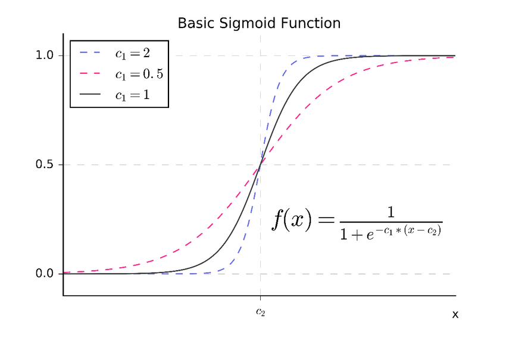
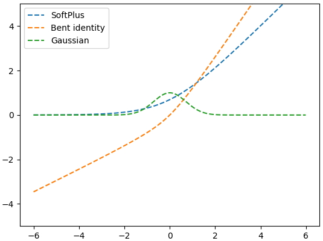

# 활성화 함수 (Activation Function)
- 일반적으로 딥러닝 계산에서는 각각의 노드에 들어오는 값들에 대해 바로 다음 레이어로 그냥 전달하지 않고 비선형 함수를 통과시킨 후 전달한다. 이 때 사용하는 함수를 활성화 함수 (Activation Function) 이라고 한다.
- 대부분의 활성화 함수는 0에서 정류된 단위를 제외하고는 연속 함수(임의의 입력 값의 작은 변화에 따라 출력 값에 작은변화가 있음)며 미분 함수(미분함수는 영역 내의 모든 점에서 미분 계수가 존재)이다. 

## 왜 비선형 함수인가?
- 선형 함수의 경우 y(x) = ax 활성화 함수를 사용시 3층의 네트워크 통과시 a(a(ax)) 가 된다. 이는 사실 결국엔 ax와 다를게 없고, 이는 층을 깊게 쌓는 의미가 없다.
- **선형 함수는 입력의 상수배만큼 변하는 것으로 f(x) = x (항등함수) 또는 f(x) = ax 또는 f(x) = ax + b 등의 1차함수가 존재한다. (모두 직선 모양)**
- 반대로 비선형은 2개 이상의 직선 또는 곡선의 모양을 가진다(Simgoid, ReLU)

- 따라서 뉴럴 네트워크에서 층을 깊게 하기 위해 비선형 함수를 사용하다.

## 활성화 함수 종류

### 선형과 계단함수 유형

### 1. 계단 함수 (Step Function)

- 최초의 활성화 함수로 선형 함수의 결과를 이진 분류로 나타내기 위한 함수

## 시그모이드 계열 (Sigmoid)

### 2. 시그모이드 함수 (Sigmoid Function)

- 시그모이드 계열은 모두 S형태의 모양으로 되어 있다.
- 모두 Monotonic (증가 또는 감소를 계속하는, 즉 단조로운) 이지만, Derivative Monotonic 하지는 않다.
- 위 그래프들에서 모두 입력값이 증가함에 따라 (x) 결과값이 증가한다 (y) 이는 단조 증가 Monotonic 하다고 표현한다. ==> 입력이 커질수록 어떤 경향을 보인다라고 해석 가능하다.
- 위 그래프들을 미분하고 봤을 때 기울기는 계속 증가하지 않는다. 이는 Derivative Monotonic 하지 않다고 하고, ==> 이런 경우 어떤 입력 값에 기울기는 증가와 감소 구간이 있어 경향을 알 수 없다라고 해석한다.

- 시그모이드 함수(Sigmoid)는 Logistic 함수라고도 불린다.
- 시그모이드는 모든 값을 확률로 변환하는데(0에서 1사이의 값들로) 유용하며 이진 분류에 사용할 수 있음. (0에서 1사이의 출력값 발생)
- 함수값이 (0,1)로 제한되며 / 중간 값은 1/2 이다.
- 매우 큰 값을 가지면 함수값은 거의 1이며, 매우 작은 값을 가지면 거의 0 이다.

- e = 2.71828... / 결국에는 구해야 하는건 ax+b
- a값은 그래프의 경사도를 의미함. a값이 클때는 시그모이드 함수가 0에서 1로 갈 때 더 경사가 커진다
- b값은 그래프의 좌우이동을 의미함.
- a가 작아지면 오차는 무한대로 커짐 (그래프는 점점 일직선이 되어감
- a와 b의 값이 클수록 오차가 생김. (원본과 비교했을 때 변하는 정도가 심하니까)

### (2-1) 시그모이드의 문제점

- Gradient Vanishing 현상이 발생한다. 미분 함수에 대해 x=0에서 최댓값 1/4를 가지고, ipnut값이 일정이상 올라가면 미분값이 거의 0에 수렴한다.
- 이는 |x| 값이 커질 수록 Gradient Backpropagation시 미분값이 소실될 가능성이 크다.
- 깊이가 깊어질수록, 중앙보다 양극으로 쏠리는 형태이기 때문에 데이터의 양극화가 일어남
- 극에 가까울수록 변화량이 작아서, 파라미터를 학습시키는 gradient값이 매우 작아지게 됨 (=x값이 변하더라도, y값의 변화가 크지 않다 -> 이 때문에 학습속도가 매우 더뎌진다.)
- 결과값이 항상 양수라 오차 역전파시 체인룰에 의해 계산되는 gradient값이 부호 편향적
- **1보다 항상 작기 때문에 오차 역전파 시 체인룰에 의해 계산되는 gradient값이 네트워크가 깊어질수록 크기가 작아져서 gradient가 제대로 반영이 되지 않음. ==> Relu 등장**

- ==> 이러한 이유들 때문에 sigmoid 는 신경망 초기에는 많이 사용되었지만, 최근에는 자주 사용되지 않는다.

### (2-3) tanh 함수(쌍곡 탄젠트 함수, 하이퍼 볼릭 탄젠트)

- **시그모이드 함수의 범위를 -1에서 1의 비선형 형태로 확장한 개념**
- tanh 함수는 함수의 중심값을 0으로 옮겨, sigmoid의 최적화 과정이 느려지는 문제를 해결함

### (2-4) tanh 함수 문제점

- 하지만 여전히 1보다 작은 값이 존재하므로 미분함수의 일정값 이상 커질시 미분값이 소실되는 기울기 소실(gardient vanishing) 문제는 사라지지 않음
- 평균이 0이기 때문에, 결과값이 양수로 편향되어 있던 문제는 해결되었으나, 여전히 극다적인 데이터, 매우 작은 gradient에 대한 문제가 해결되지 않음.

## Relu 계열

- ReLU 계열들은 양수입력에 대한 결과값은 모두 같다.
- 음수입력에서는 다른 결과값이 나온다.
- Leaky ReLU는 알파값에 따라 기울기가 달라진다.
- ELU는 음수값이 0에 가까울때느 변화가 크고, 아래처럼 0에서 멀어질수록 거의 변화가 없게 된다.
- 모두 Monotocnic 증가 또는 감소를 계속하는, 단조로운 하고, Derivative Monotonic 하다
- 어떤 입력값이 커질수록 어떤 경향을 보인다로 해석 가능
- 어떤 입력 값의 기울기는 어떤 경향을 보인다로 해석 가능하다

### 3. Relu 함수 (Rectified Linear Unit)
- 시그모이드의 대안으로 가장 많이 사용되는 활성화 함수.

- x>0 이면 기울기가 1인 직선이고, x<0이면 함수값이 0이됨.
- 선형이기 때문에 gradient descent방해를 받지 않아 다른 활성화 함수에 비해 학습, 연산속도가 빨라짐

- **연산이 빨라 지는 이유는 시그모이드와 tanh 둘다 항상 신호를 출력하기 때문에 ANN이 매우 무거워 지는데 그 반면 ReLU는 때때로 신호를 출력하지 않기 때문에 일부 뉴런을 무효화하기 때문에 희소성을 증가시키고 좋은 현상이 된다. **
- 허나 급격한 gradient값에 의해 특정 노드의 파라미터가 0이 될 경우, 영원히 0으로 남을 수 있음 (=일부 뉴런 무효화)
- **x가 0보다 작을 때는 모든 값을 0으로 처리하고, 0보다 큰 값은 x를 그대로 사용하는 방법.**
- **x가 0보다 크기만 하면 미분값이 1이 되므로 여러 은닉층을 거치며 곱해지더라도 맨 처음 층까지 사라지지 않고 남아있을 수 있음.**

### (3-1) 렐루의 문제점
- x<0인 값들에 대해 기울기가 0이기 때문에 뉴런이 죽을 수 있는 단점 존재 (Dying ReLU)

### (3-2). Leakly ReLU
- leakly ReLU는 ReLU의 뉴런이 죽는 Dying ReLu 현상을 해결하기 위해 나온 함수.
- 함수도 매우 간단한 형태로 다음과 같다 -> f(x) = max(0,01x, x)
- Leakly ReLU는 음수의 x값에 대해 미분값이 0되지 않는다는 점을 제외하면 ReLu와 같은 특성을 가짐.
- 0이하의 값에서 가중치들이 죽어버리는 현상 해결

### (3-3) PReLU
- Leakly ReLu와 거의 유사하지만 새로운 파라미터 α를 추가하여 x<0 에서 기울기를 학습할 수 있게 함 -> f(x) = max(αx, x)

### (3-4) Exponential Linear Unit (ELU)

- ELU는 2015년에 나온 함수
- ReLU의 모든 장점을 포함 및 Dying ReLU 문제를 해결
- 출력값이 거의 zero-centered에 가까우며, 일반적인 ReLu와 달리 exp 함수를 계산하는 비용 발생

### (3-5) Maxout 

- ReLU를 일반화시켜서, w1, w2, b1, b2 가 학습이 되도록 파라미터를 추가
- **성능이 가장 좋지만 학습을 하는 파라미터의 수가 증가하며, 무조건 maxout을 사용하는 것이 답이 될순 없음**

## 4. 기타 계열

### (4-1) 소프트플러스
- ReLU의 0이 되는 순간을 완화한 소프트 플러스

#### 기타 정리

## 참고링크
- https://reniew.github.io/12/

- https://m.blog.naver.com/PostView.nhn?blogId=wideeyed&logNo=221017173808&proxyReferer=https:%2F%2Fwww.google.com%2F